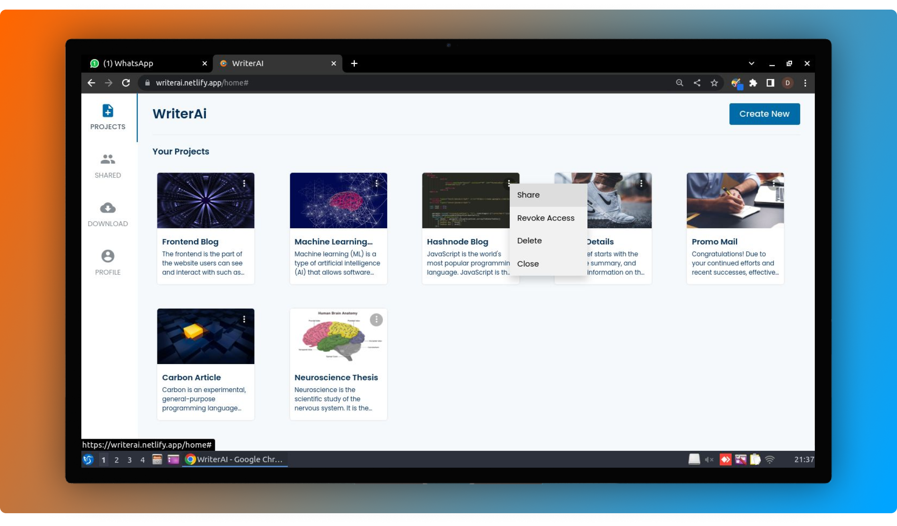
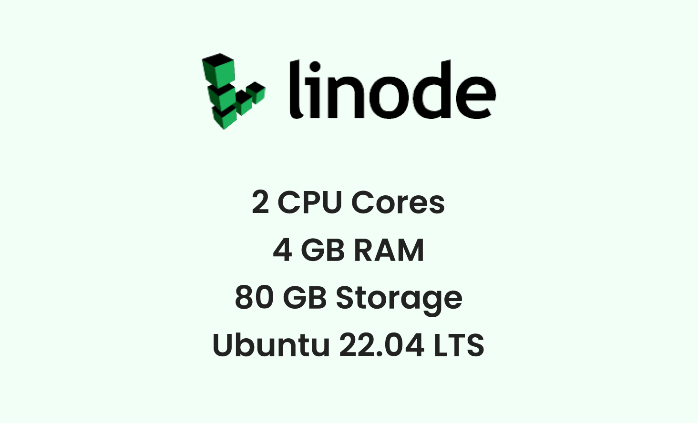
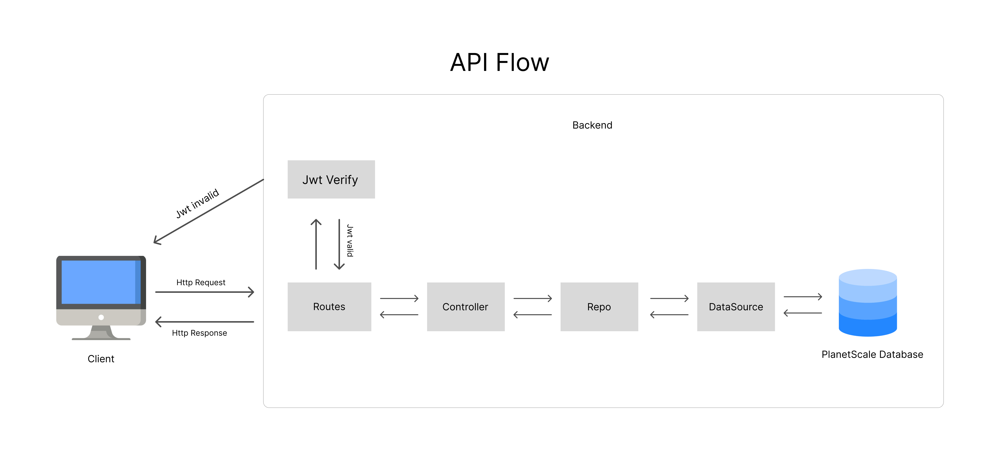
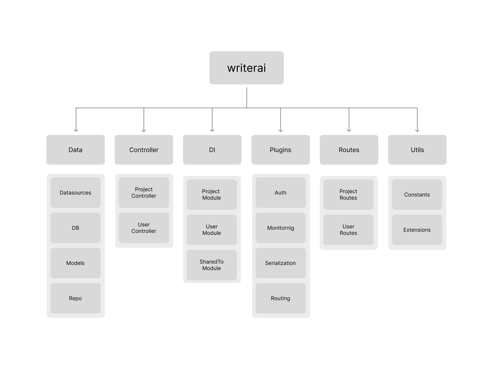
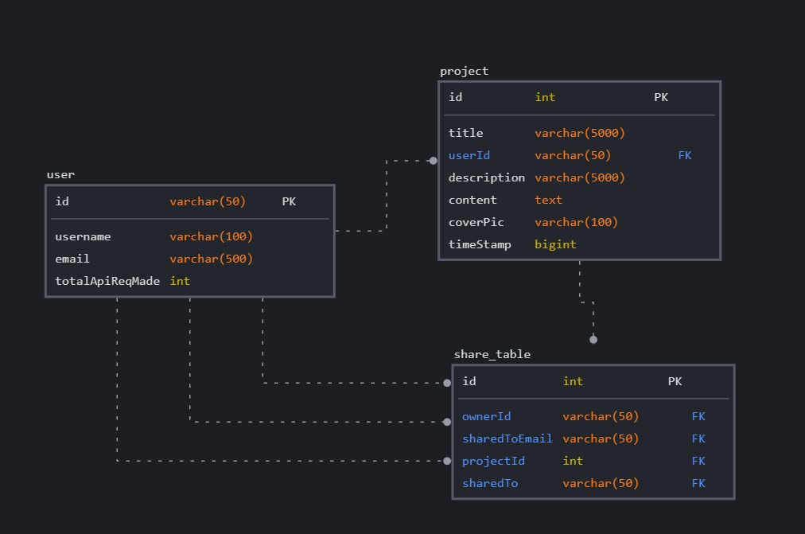
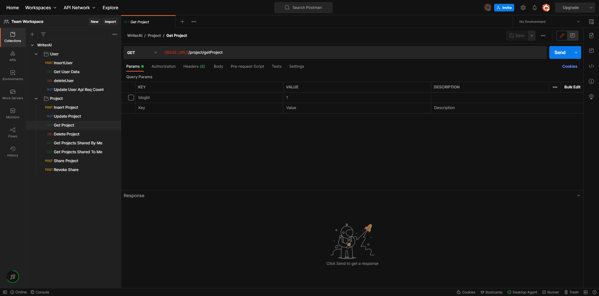

# **WriterAI** 

**WriterAI** is an AI based content writing tool that helps users easily write high quality emails, blogs, letters, thesis and other stuff. One can also share their project with others and work as a team.

This project is developed by **Team 404** for Hashnode x PlanetScale hackathon. This team comprises of [Ishant](https://github.com/ishantchauhan710/) and [Vaibhav](https://github.com/Vaibhav2002).

## Blog :writing_hand:
To know more about how we built this project, read my article here: <br>
[https://ishantchauhan.hashnode.dev/WriterAI-securely-store-access-and-share-your-files-on-cloud](https://ishantchauhan.hashnode.dev/WriterAI-securely-store-access-and-share-your-files-on-cloud)

## About



**WriterAI** is an AI based content writing tool that helps users easily write high quality emails, blogs, letters, thesis and other stuff. One can share their project with others and work as a team.
#### [Here](https://youtu.be/m9J6BRdM-yo) is a short video on how to use WriterAI

## Live Usage

You can experience the power of WriterAI from [here](https://writerai.netlify.app)

## WriterAI Features


- **Auto Text Completion** - Generates up to 120 words with an input of just 5 words
- **Inbuilt Text Editor** - For writing your blogs, emails, letters, e-books and other stuff
- **Project Sharing** - You can share your project with unlimited number of users and work in teams
- **Markdown Support** - You can add images, tables, hyperlinks and code snippets in your projects by using markdown syntax
- **Project Download** - You can download your projects in JSON, XML and Markdown formats
- **Platform Compatibility** - WriterAI is highly responsive and has been tested on the latest versions of Chrome, Safari and Opera Mini
- **User Authentication** - Supports Email-Password authentication and Google Mail authentication
- **User Authorization** - WriterAI keeps on validating the user's auth tokens every 5 minutes automatically in order to prevent any unauthorized access

## Technical details

- The frontend of WriterAI is created using technologies like CSS, ReactJS and MaterialUI. WriterAI is highly responsive and is tested on all popular browsers like Chrome, Safari and Opera Mini. For handling the react state\s, ContextAPI is used. The frontend code is highly structured and BEM convention is followed throughout the entire CSS code.

- The backend of WriterAI is built using the power of Ktor, Kotlin and PlanetScale! It follows MVC architecture, DRY and SOLID code principles. Currently, the backend part is deployed on Linode, which is a popular cloud service provider platform for deploying your backend and database!


### Setup [Backend]
To setup the backend of WriterAI,

1. Clone this repository and open it in Intellij IDEA IDE
2. Add the environment variables listed below
3. Create an account on Linode and there, setup an ubuntu server using their docs
4. Install java, nginx, ufw and certbot
5. Open ports for http and https using ufw
6. Set up NGINX by going through linode's docs. Ensure that it listens to 8080 port
7. Enable SSL using certbot (You will be needing a domain for that)
8. Now in Intellij IDEA, install shadowJar plugin and export the fat jar file
9. Upload that jar file to linode using scp tool in linux from your local machine
10. Then open your linode's terminal on your local machine using ssh
11. Then type:

```
vim /etc/environment
```

```
12. Then in the file opened, type:

export DB_URL = planetscale-url
export DB_USERNAME = planetscale-username
export DB_PASSWORD = planetscale-password
export PORT = 8080
```

13. Then press Ctrl+W to save and Ctrl+QA! to exit
14. Then go back to root directory by writing cd ../../ and then in terminal, write:

```
source /etc/environment
```

This will update the environment variables

15. Lastly, setup a firebase account and setup up Firebase ADMIN SDK by following [this](https://firebase.google.com/docs/admin/setup#initialize-sdk) and paste the config json file in resource folder. Ensure that you need to use the same file for frontend part as well

16. Finally, start the server by going to the directory where you backend jar file is and writing:
```
java -jar your_backend_file.jar
```

### Server Configurations



### Built With [Backend] 🛠
* [Linode](https://linode.com) - Linode is a popular cloud hosting service provider where you can deploy your backend
* [Ktor](https://ktor.io) - Create asynchronous client and server applications using the power of Kotlin.
* [Kotlin](https://kotlinlang.org) - A modern programming language that makes developers happier.
* [PlanetScale](https://planetscale.com) - A MySQL-compatible serverless database platform.
* [Jetbrains Exposed](https://github.com/JetBrains/Exposed) - Jetbrains Exposed is an ORM framework for Kotlin.
* [Koin](https://insert-koin.io) - Koin is a smart Kotlin dependency injection library.
* [Firebase](https://firebase.google.com) - Uses Firebase Admin SDK for authenticating and validate user's JWT auth token.

### Architecture [Backend]
The backend of WriterAI uses [***MVC (Model View Controller)***](https://en.wikipedia.org/wiki/Model%E2%80%93view%E2%80%93controller) architecture.


#### This is how the API flow works


### Package Structure [Backend] :open_file_folder:



    main                            # Root Directory
    .
    ├── kotlin.com.writerai         # Contains all the Ktor server code
    |   ├── data                    # Contains all the data handling code, which includes Database, DataSources, Repositories, Data models and Response models
    |   ├── controllers             # Contains files with business logic of specified routes
    │   ├── di                      # Contains module which configuration of dependency inject in the project
    │   ├── plugins                 # Contains all the required plugins to be used by Ktor Server like authentication, logging, routes and many more
    │   ├── routes                  # Contains all the API routes like all routes for Projects, user and more
    │   └── util                    # Utility files to make work easier like extension functions and helper classes
    |
    └── resources                   # Contains all the configurations required to run the Ktor Server


### Database Schemas 

#### This is how the Database relationhip looks like


#### User Schema
```kotlin
object UserTable : IdTable<String>() {
    val email: Column<String> = varchar("email", 500).uniqueIndex()
    val username: Column<String> = varchar("username", 100)
    val totalApiReqMade: Column<Int> = integer("totalApiReqMade")
    override val id: Column<EntityID<String>> = varchar("id", 100).entityId()
    override val primaryKey = PrimaryKey(id)
}
```
#### Project Schema
```kotlin
object ProjectTable : IntIdTable() {
    val userId: Column<String> = varchar("userId", 100)
    val title: Column<String> = varchar("title", 5000)
    val description: Column<String> = varchar("description", 5000)
    val content: Column<String> = text("content")
    val coverPic:Column<String> = varchar("coverPic", 1000)
    val timeStamp: Column<Long> = long("timeStamp")
}
```
#### ShareTo Schema
```kotlin
object ShareTable : IntIdTable() {
    val ownerId: Column<String> = varchar("ownerId", 100)
    val sharedTo: Column<String> = varchar("sharedTo", 100)
    val sharedToEmail:Column<String> = varchar("sharedToEmail", 500)
    val projectId: Column<Int> = integer("projectId")
}
```

### Available APIs [Backend] :computer:
The backend of WriterAI provides many APIs to perform different operations such as insert user, getProjects, share Project, get all shared projects etc. All the available APIs and their corresponding routes can be found inside the routes folder.



## Attribution
The project uses [PlanetScale](https://planetscale.com) as its database and is made for the [Hashnode X PlanetScale Hackathon](https://townhall.hashnode.com/planetscale-hackathon).

## Contact
For any queries, you can [connect with me](https://vaibhavjaiswal.vercel.app/#/)
  


